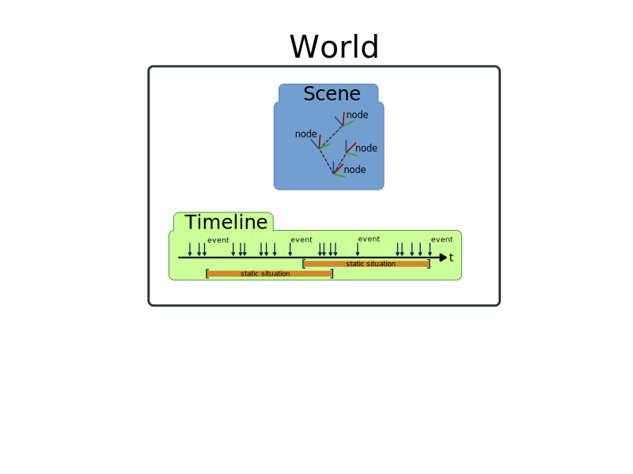
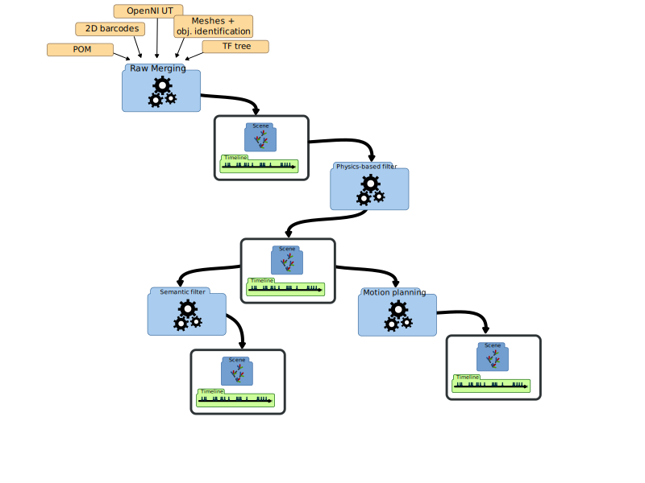
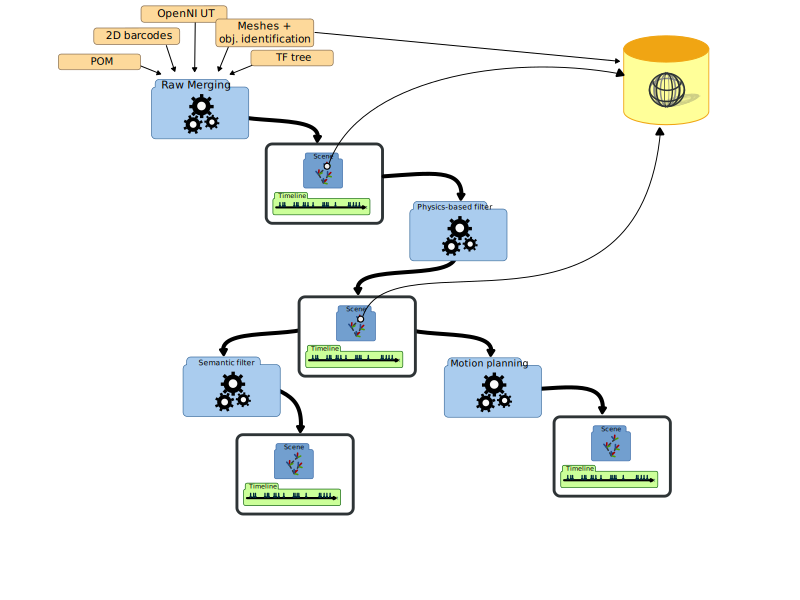

Underworlds: Geometric & Temporal Representation for Robots
===========================================================

Description
-----------

Underworlds is a distributed and lightweight framework that aims at sharing
between clients parallel models of the physical world surrounding a robot.

The clients can be geometric reasoners (that compute topological relations
between objects), motion planner, event monitors, viewers... any software that
need to access a geometric (based on 3D meshes of objects) and/or temporal
(based on events) view of the world.

One of the main specific feature of Underworlds is the ability to store many
parallel worlds: past models of the environment, future models, models with
some objects filtered out, models that are physically consistent, etc.

This package provides the library, and a small set of core clients that are
useful for inspection and debugging.

Installation
------------

The only mandatory prerequisite is the Python bindings of `ZeroMQ` (`apt-get
install python-zmq`).

`pyassimp`, `python-OpenGL` and `pygame` are also necessary to use the 3D mesh
loader and the 3D scene viewer (`apt-get install python-pyassimp python-opengl
python-pygame`).

Then:

```
> python setup.py install
```

First tests with Underworlds
----------------------------

1- Start the `underworlds` daemon:

```
> underworlded start
```

2- Load some model:

```
> uwds-load testing/res/monkey_mat.dae test
```

This loads 3 monkey heads in the 'test' world.

3- Get a 3D view of this world:

```
> uwds-view test
```

Open an OpenGL windows that display the content of the 'test' world. You can
click on meshes to move them with the keyboard.

Running the unit-tests
----------------------

Underworlds provides a fairly extensive set of unit-tests. Run them with:

```
> cd testing
> ./run_test.py
```

Documentation
-------------

At very high-level, Underworlds can be seen as a shared (across threads and
process) datastructure that represents on one hand *geometric scenes* (made of 3D meshes for
instance) and on the other hand the history of these scenes as *timelines*. A pair
(3D scene, timeline) forms a *world*.



Underworlds allows to create, alter, query, compare these worlds, their scences
and timelines in a distributed fashion: one software component may track
the 3D position of humans around the robot, while another detect some objects on
tables, while another expose the current pose of the robot itself. A fourth
module may query these models to perform some motion planning, a fifth one
performs geometric reasoning using a physics engine, and so on.



The core library comes with a few useful components that can be used as starting
points for your own components.

[uwds-load](bin/uwds-load) for instance opens a static 3D model (like a FBX
file) and adds it to a specific world. Let's see how this example work.

The interesting part of the loading takes place in the [method load of
ModelLoader](src/underworlds/tools/loader.py#L92):

First, we create a *context*: the context encapsulates a connection to the
shared datastructure. We give each context a name (typically, the name of the
component -- here `model loader`): this is useful to debug/introspect the
system.

```python
with underworlds.Context("model loader") as ctx:
    # ...
```

The context object `ctx` gives access to the shared worlds. For instance:

```python
ctx.worlds["test"]
```

either returns the world `test` if it already exists (some other component may
have created it, for instance) or it creates a new one (which becomes
immediately visible and accessible to every other software components connected
to the Underworlds server).

Next, we can access the scene and the timeline attached to this world:

```python
world = ctx.worlds["test"]
scene = world.scene
timeline = world.timeline
```

Keep in mind that `world`, `scene`, `timeline` are datastructures shared amongst
all the software components (clients) connected to the server! A scene or a
timeline can be updated at any time by any component! While you iterate over a
scene (for 3D rendering for instance), Underworlds makes no guarantee that the
objects (nodes) will remain constant during the iteration, and you need to be
especially careful for inconsistencies.

To avoid these inconsistencies as much as possible, software components are therefore
generally advised to only *write* to worlds that they have themselves created.
This is however not enforced, and sometimes it makes perfectly sense to have
several components updating together the same world. One example could be
several perception modules that estimate in parallel the pose of different
objects: they would typically update a same world called for instance `raw
perception`.

### Scenes and nodes

A scene represents a 3D environment, made of a set of *nodes*: a node can
represent either a physical object (or part thereof), or a camera (more types of
nodes may be added in the future, like *fields*). The
[node](src/underworlds/types.py#L25) itself has several properties like a unique
identifier, a name, possibly a list of children nodes, a 3D transformation
matrix relative to its parent, etc.



Besides, nodes that represent physical objects (`node.type == MESH`) have meshes
attached. Because meshes can represent a large amount of data, they are stored
by the server on a separate static store, indexed by their hash value. This way,
only the hashes of the meshes are stored with the node. If a specific component
need the actual mesh data (for instance, for rendering), it must separately
request the mesh data from the Underworlds server (by calling
`ctx.get_mesh(<mesh hash>)`).

Scenes always have one special node, the *root node*, and every other node in
the scene is utimately parented to this node. It can be access with
`scene.rootnode`.

*to be continued...*

### 3D rendering

The [uwds-view](bin/uwds-view) client shows how the datastructures provided by
Underworlds can be used for realtime 3D rendering with OpenGL.

This simple viewer can be used as a starting point for more complex rendering
applications.

### Implementing a filter

*Filters*  are a common pattern in a Underworlds-based system. We call a
*Filter* a software component that monitors a world A, processes somehow its
content, and generates a new world B which is a filtered version of A. One
possible example is a physics-based filter (see the diagrams above): this filter
would read the positions of various objects from a 'raw' world fed by the
sensors. Because perception routines are usually slightly inaccurate, some
objects may be detected as if they were *inside* others, or on the contrary
flying in the air, above their support. Using a physics engine, a physics-based
filter would correct these misdetections, and place the objects at stable
locations. This creates a new world that one could call `stable world`. This new
world could then be used as input for further processing by other reasonners,
planners, etc.

[flying_filter.py](clients/flying_filter.py) implements a naive version of such
a physics-based filter (it simply makes flying objects to 'drop' on their
supports).

